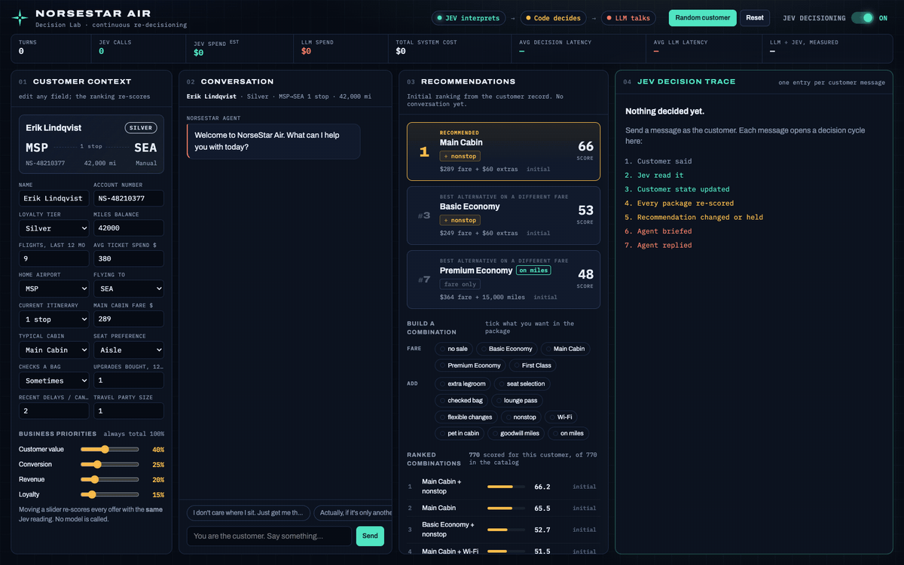

<p align="center">
  
</p>

# NorseStar Air

A working demo of a **decision model sitting inside a conversation**. The airline is a prop. The
subject is the loop:

> The chat model talks. A decision model reads the uncertainty. Plain code makes the business
> decision. The whole thing re-decides every time the customer says something new.

You play the customer. A chat model plays the booking agent. After every message the page shows, in
order: what you said, what the decision model was asked, the probabilities it returned, the signals
that entered the ranking engine, what the engine picked and why, the exact context handed to the
chat model, what the agent replied, and what each stage cost in time and money.

Everything runs in your browser. You bring your own [OpenRouter](https://openrouter.ai) key, it
stays in the tab, and nothing is sent anywhere except openrouter.ai.

## Why I built it

Most of what gets handed to a large language model is not writing. It is judgment: small,
repetitive calls with one right answer. *Is this person traveling for business? Do they want the
lounge pass? Are they ready to buy?* A chat model can answer those, but it answers in prose, it
costs real money at volume, and you cannot tune it without paying to re-run everything.

A decision model answers the same questions with a calibrated probability instead of a sentence,
for a fraction of a cent. I wanted to see what a system looks like when talking and deciding are
separate jobs, and whether the seam between them shows. Airline retailing was a hard enough case to
be worth it: the right answer changes mid-conversation, the options combine into hundreds of
packages, and a bad recommendation is obvious the moment you read it.

## What I found

**Splitting the two makes the decision auditable.** Every ranking on screen traces back to a
probability and a weight you can read. The chat model never picks anything; it is handed the
decision and the exact prices and told to write the sentence. That is the whole point of the trace
panel — you can argue with a number instead of a vibe.

**It only hears what a question was written for.** Early on, a customer asking for "a direct
flight" moved nothing at all, because no question asked about a nonstop. The set has since grown
from 14 questions to 24. The next unasked thing will be missed exactly the same way: ask about
priority boarding today and nothing happens. The fix is always the same two lines — a question, and
a weight.

**Tuning is free after the first run.** Because the output is a probability rather than prose, you
can cache every answer and re-score offline. Changing a weight and seeing what breaks costs
nothing. Ask a chat model to "be stricter" and every attempt is a full paid run.

**Ranking combinations rather than single offers needed guards.** The catalog is 770 combinations —
a fare, optionally paid partly in miles, plus any subset of nine add-ons. Without four specific
brakes in the scoring, the biggest bundle wins every time simply for being big. Each brake exists
because a plausible-looking recommendation turned out to be wrong first.

**The chat model can still quietly disobey.** It once overrode a $420 recommendation and pitched a
cheaper one on its own. The reply read perfectly. Only the trace showed the disagreement. The
prompt forbids it now and the model is handed exact prices so it has no arithmetic to do, but
nothing verifies the reply against the decision. That gap is real and it is still there.

**The talking costs far more than the deciding.** The page measures both live. On the run in the
animation above, the chat reply cost about 16 times more and took about 3.6 times longer than all
24 decision questions put together.

## Run it on your desktop

You need Node 20 or newer and an [OpenRouter API key](https://openrouter.ai/settings/keys). There
is no install step, no dependencies and no build.

```bash
git clone https://github.com/WorthingtonCloud/norsestar-air.git
```

```bash
cd norsestar-air && node serve.mjs
```

Open `http://localhost:4411` and paste your key when the page asks. Click **Random customer**, then
type a sentence and watch the right-hand panel.

Your key is held in the tab and never written to disk, so a reload asks for it again. A Content
Security Policy blocks every background connection except openrouter.ai, and the source is short
enough to read before you trust it. A handful of messages costs about a penny.

Both models are called through OpenRouter with that one key: `typesafe/jev-1.13` for the decisions
and `anthropic/claude-haiku-4.5` for the reply.

## How it works

Each customer message fires 24 typed questions at the decision model in four parallel calls. The
answers come back as probabilities, not sentences. Plain code turns those into signals, scores all
770 package combinations against four business priorities in about ten milliseconds, and picks a
winner. The chat model is then handed the winning package, the exact prices and a short list of
rules, and writes the reply.

| file | what it holds |
|---|---|
| `lib/questions.mjs` | the 24 questions and the wording of each |
| `lib/jev.mjs` | the decision API call |
| `shared/engine.mjs` | the ranking, the weights and the four brakes |
| `shared/flight.mjs` | the fares and add-ons that make up the 770 combinations |
| `lib/agent.mjs` | the chat model's prompt and guardrails |
| `index.html`, `app.js`, `styles.css` | the page and the trace panel |

Flip **JEV Decisioning** off to see the same engine and the same agent working from the static
customer record alone, deaf to the conversation.

## What it does not do

No authentication, no database, no multiple users, no real booking and no flight search — ask for
Miami on a Seattle record and the agent will tell you so. The weights are hand-set and plausible,
not fitted to data, so near-ties at the top flip on small changes. Each cycle re-reads the whole
conversation from scratch, so a customer who opened with "cheapest" can be shown a premium package
three turns later if nothing since restated the budget. Decision cost is an estimate priced from
tokens; the reply cost is an actual bill.

## License

MIT. Copy it, take it apart, use it for something else.
